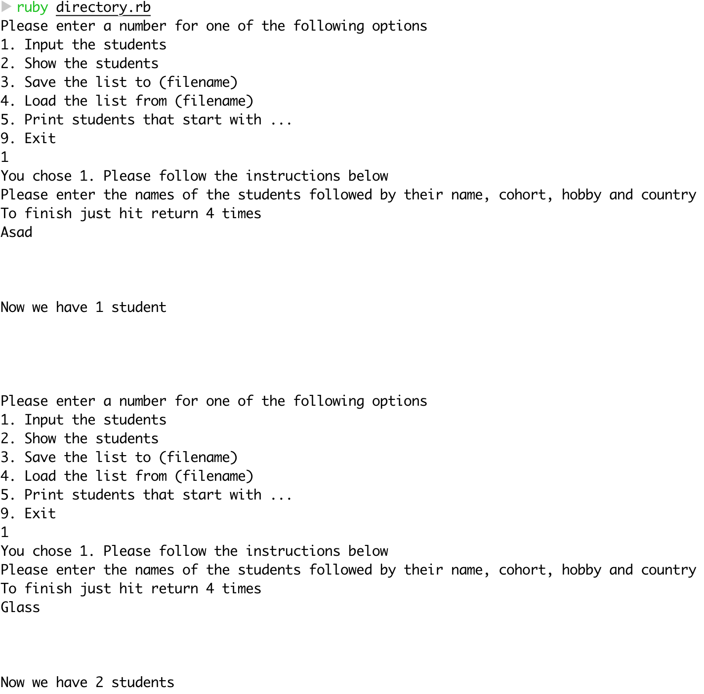
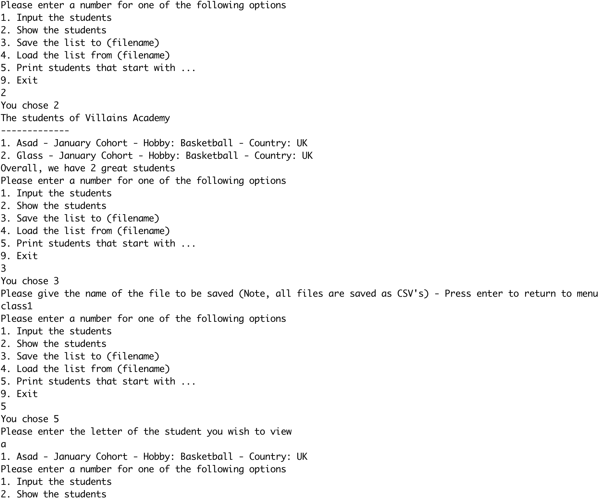

# Student Directory #

The student directory script allows you to manage the list of students enrolled
at Villains Academy

## How to use ##

```shell
ruby directory.rb
```

Please choose from the following commands that are shown as it an interactive directory that takes input for the user. You are able to:
1. Save students
2. Display students
3. Save students into a csv file
4. Load up a saved students csv file
5. Print the students that start with a specific letter
6. Exit

## Screenshot of the app in action




